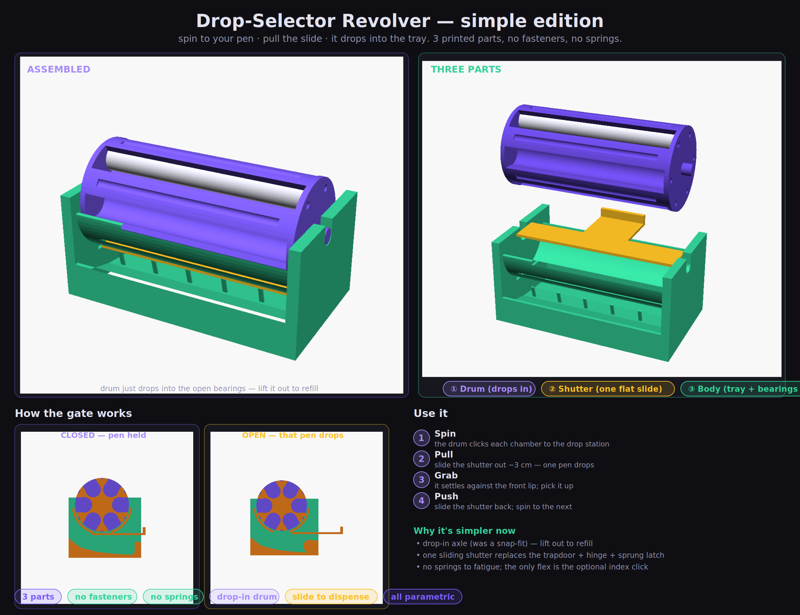

# Peptide Pen "Drop-Selector Revolver" — simple edition

Spin the fluted drum to your pen, **pull the slide**, and that one pen drops into
the catch tray and rests at the front lip. Built to be as simple as possible:
**3 printed parts, no fasteners, no springs to fatigue.**

## How to use
1. **Spin** the drum — it clicks each chamber into the bottom drop station.
2. **Pull** the shutter out ~3 cm — that one pen drops.
3. **Grab** it where it settles against the front lip.
4. **Push** the shutter back, spin to the next.

To **refill**, just lift the whole drum straight up out of its bearings and drop
pens into the chambers (or spin a chamber to the open top and drop one in).

## The three parts
| Part | What it is | Assembly |
|---|---|---|
| **Drum** | Fluted revolver cylinder with **integral axle stubs** and side-open chambers. | **Drops into** the body's open-top bearings. Lifts out to refill. |
| **Body** | One piece: catch tray + two uprights + open-top bearings + shroud + shutter track + the index leaf-spring. | — |
| **Shutter** | **One flat slide** ("drawer pull"). Closed, it completes the shroud and holds the bottom pen in; pulled out, that pen drops. | **Slides into** the track from the front. |

That's it — drop the drum in, slide the shutter in. No screws, no rods, no glue.

## What changed from the button version (why it's simpler)
The earlier design had a sprung button **latch + hinged trapdoor + snap-on axle** —
four fiddly, spring-loaded things to print and tune. This edition removes all of
them:

- **Drop-in axle** — the drum has integral stubs that rest in **open-top
  U-bearings**. No snap-fit force, and you lift the drum out to refill.
- **Sliding shutter** — one flat part replaces the trapdoor + hinge + sprung
  latch. Nothing to fatigue; the pen's weight doesn't push it open.
- **One-piece body** — tray, uprights, bearings, shroud and track are all printed
  together, so assembly is just "drop in the drum, slide in the shutter."

The only flexing part left is the **optional** auto-index click (a leaf-spring
nub that drops into a dimple per chamber). Turn it off with `detent_on=false` if
you want zero springy features.

## Still here from before
- **Fluted revolver look** with side-open chambers (the "not completely round"
  drum you liked).
- **Auto-index click** so every chamber self-locates at the drop station.
- **Concave catch ramp + cushion fingers + tall front lip** so the pen lands
  gently and can't bounce out.

## Default dimensions
| | |
|---|---|
| Pen assumed | Ø19 × 150 mm |
| Chambers | 6 |
| Drum | Ø74.5 × 158 mm (+ axle stubs) |
| Body | ≈ 176 (W) × 100 (D) × 78 (H) mm |

All parametric — change `pen_diameter`, `pen_length`, `num_chambers` and the rest
resizes.

## Files
- `peptide-pen-dropper.scad` — main model + parameters (open this).
- `peptide-pen-dropper-parts.scad` — body / shutter / preview modules (auto-included).
- `compose_simple.py` — builds the preview sheet.
- `dropper-preview.png`, `simple_*.png` — the images above.

## Print & assemble
1. In [OpenSCAD](https://openscad.org), set your real pen size, then export each
   part by setting `part` to `"drum"`, `"body"`, `"shutter"` and rendering (F6) →
   Export STL.
2. Suggested settings:
   - **Drum:** stand it on an end face, 0.2 mm, 15–20 % infill, no supports.
   - **Body:** tray down. The shroud arch benefits from **tree/organic supports**
     (they peel off the smooth trough cleanly); everything else is support-free.
   - **Shutter:** flat, 0.2 mm.
   - **Material:** PETG or PLA. (No living hinges, so material isn't critical.)
3. Drop the drum's stubs into the body's open-top bearings; slide the shutter into
   its front track. Done.

> Preview the motion: `part="section"` with `shutter_state="closed"` vs `"open"`,
> or `part="detentview"` for the index click.

## Tuning cheatsheet
| Want… | Change |
|---|---|
| More / fewer chambers | `num_chambers` |
| Looser / tighter pen fit | `clearance` |
| Looser / tighter drum spin | `bearing_gap` |
| Looser / tighter shutter slide | `shutter_gap` |
| Longer / shorter shutter pull | `shutter_travel` |
| Bigger / smaller drop window | `win_ang` |
| Firmer / lighter index click | `detent_nub`, `detent_t` |
| No springy parts at all | `detent_on=false` |
| Softer landing / no cushion | `cushion_on` |
| More / less of the drum visible | `top_open` in `shroud2d()` |
| Taller drop (more headroom) | `drop_clear` |

> Print the **drum + body + shutter** at a small scale first to check the spin,
> the click and the slide before committing to the full-size print.
