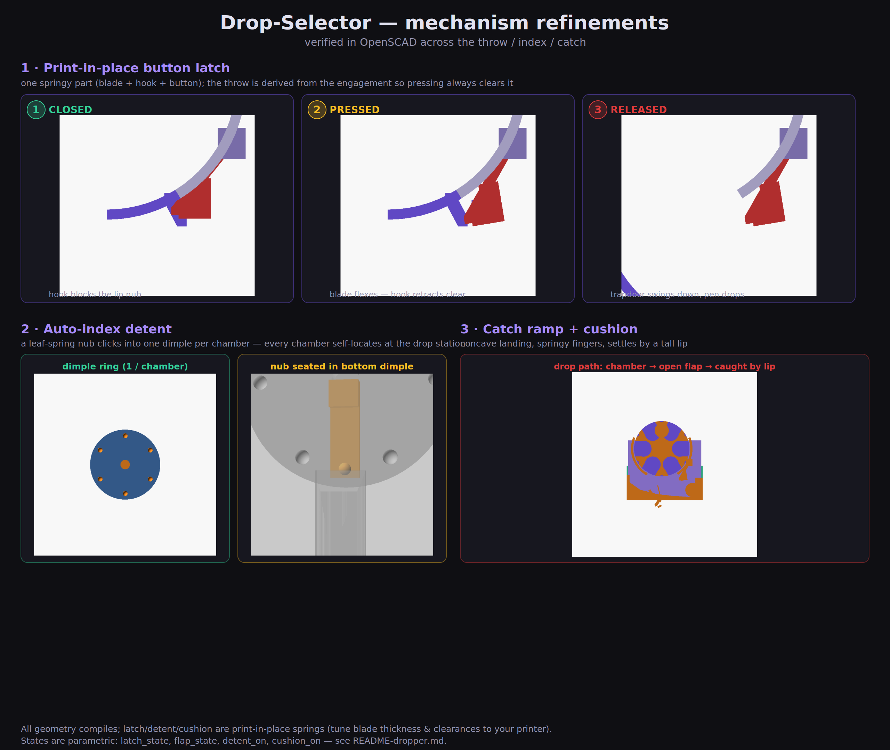

# Peptide Pen "Drop-Selector Revolver"

The next evolution of the [revolver](README-revolver.md): spin the fluted drum
to the pen you want, **press one button**, and that single pen is released — it
drops through a trapdoor into an angled catch tray below and rolls forward to a
lip where you grab it.

## How the drop works
1. **Spin** the drum — an **auto-index detent clicks** each chamber into the
   bottom "drop station" so it's always lined up.
2. **Press** the button — the print-in-place spring **latch** releases the trapdoor.
3. **Drop** — the trapdoor swings down and that one pen falls.
4. **Catch** — it lands on a **concave cushioned ramp** and settles against a
   tall front lip, where you grab it (it can't bounce out).

## The four printed parts
| Part | What it is |
|---|---|
| **Drum** | Fluted revolver cylinder. Chambers are **side-open pockets** (rounded cradles) so a pen can drop straight out — this is what gives it the "not completely round" revolver look you wanted. |
| **Cradle** | Legs + axle pins (the drum spins on them) + a **shroud** that wraps the lower half to keep pens in + the **print-in-place button latch** + the **auto-index detent** leaf-spring. |
| **Flap** | The **trapdoor**. Its hinge rod snaps into clips on the cradle; the latch hook holds its outboard lip-nub shut until you press the button. |
| **Secondary base** | The lower catch unit. The cradle legs **slide down into grooves** in its side walls ("the panel slides into and is received by"). Inside is the **concave catch ramp, cushion fingers + tall front lip**. |

## Why the chambers are open-sided (the honest trade-off)
A pen lying in a *closed* round bore (like the plain revolver) can't fall out
sideways — great for holding, impossible for a gravity drop. To let a chamber
**drop its pen on demand**, each chamber is an outward-open pocket and the
**shroud** holds the pens in everywhere except the top (where gravity does it)
and the bottom drop window (closed by the trapdoor). Net effect: it still reads
as a fluted revolver, and it can release one pen at a time.

## The three mechanisms (now modelled + verified)

Each of these is modelled as a **print-in-place spring** and previewed in both
states so you can see the motion (set the `*_state` parameters and render):

1. **Print-in-place button latch.** A single springy part — blade + hook +
   button — anchored only at the top. The hook blocks an outboard nub on the
   flap's lip. Pressing the button flexes the blade and retracts the hook. The
   **throw is derived from the engagement depth** (`press_ang = atan(latch_throw
   / blade_L)`), so as long as `latch_throw ≥ hook_grab` the hook is guaranteed
   to clear — preview `latch_state="closed"` vs `"pressed"` to confirm.
2. **Auto-index detent.** A ring of ball-detent **dimples on the drum end face,
   one per chamber**, and a leaf-spring nub on the leg that flexes into a relief
   pocket. The nub drops into the bottom dimple, so every chamber self-locates at
   the drop station and you feel a click as you spin.
3. **Catch ramp + cushion.** The tray floor is a **concave landing** that turns
   the drop into a glancing roll, optional **print-in-place cushion fingers**
   soak up the impact, and the pen settles against a **tall front lip** that it
   can't bounce over.

### Still a concept-level spring (read this)
These are real, verifiable geometries — but the *feel* of any printed spring
(button force, click strength, hinge friction) depends on your filament, wall
counts and clearances. Budget a tuning pass: start with the
`latch_t`, `detent_t`, `detent_nub` and `latch_gap` parameters. If you'd rather
de-risk entirely, the tuning table lists no-spring fallbacks.

## Default dimensions
| | |
|---|---|
| Pen assumed | Ø19 × 150 mm |
| Chambers | 6 |
| Drum | Ø75 × 158 mm |
| Overall | ≈ 200 (W) × 110 (D) × 140 (H) mm |

All parametric — change `pen_diameter`, `pen_length`, `num_chambers` and the
rest resizes.

## Previewing the motion
Set `part` and the state parameters, then render (F5):
- `part="latchtest"` with `latch_state` / `flap_state` → the latch throw & drop.
- `part="detenttest"` → the dimple ring + leaf-spring nub.
- `part="section"` with `flap_state="open"` → the full drop path + caught pen.

## Files
- `peptide-pen-dropper.scad` — main model + parameters (open this).
- `peptide-pen-dropper-parts.scad` — cradle / flap / secondary / mechanisms / preview modules (auto-included).
- `compose_dropper.py`, `compose_mechanisms.py` — build the labeled preview sheets.
- `dropper-preview.png`, `dropper-mechanisms.png`, `drop_*.png`, `m_*.png` — the images above.

## Print & assemble
1. In [OpenSCAD](https://openscad.org), set your real pen size, then export each
   part by setting `part` to `"drum"`, `"cradle"`, `"flap"`, `"secondary"` and
   rendering (F6) → Export STL.
2. Suggested print settings:
   - **Drum:** standing on its back face, 0.2 mm, 15–20% infill, no supports.
   - **Cradle:** shroud-up; light supports under the axle pins and latch.
   - **Flap:** flat, 0.2 mm.
   - **Secondary:** flat, 15% infill.
   - **Material:** PETG (a bit tougher for the latch/hinge).
3. Snap the flap's hinge rod into the cradle clips; snap the drum onto the axle
   pins; slide the cradle legs down into the secondary base grooves.

## Tuning cheatsheet
| Want… | Change |
|---|---|
| More / fewer chambers | `num_chambers` |
| Looser / tighter pen fit | `clearance` |
| More / less of the drum visible | top opening angle in `shroud2d()` (`±68`) |
| Stronger / weaker flutes | `flute_depth` |
| Softer / stiffer button | `latch_t` (blade thickness) |
| Longer / shorter button press | `latch_throw` (keep ≥ `hook_grab`) |
| Looser / tighter print-in-place fit | `latch_gap` |
| Firmer / lighter index click | `detent_nub`, `detent_t` |
| Turn off the click / cushion | `detent_on=false`, `cushion_on=false` |
| Bigger air gap above the tray | `drop_clear` |
| **Simpler, no-spring flap** | set the latch aside and just flip the flap up by hand to drop |
| **Sliding bolt instead of latch** | replace `latch_spring()` with a pull-tab bolt across the flap lip |

> Print the **drum + cradle + flap** first and get the spin/drop feeling right
> before printing the larger secondary base.
