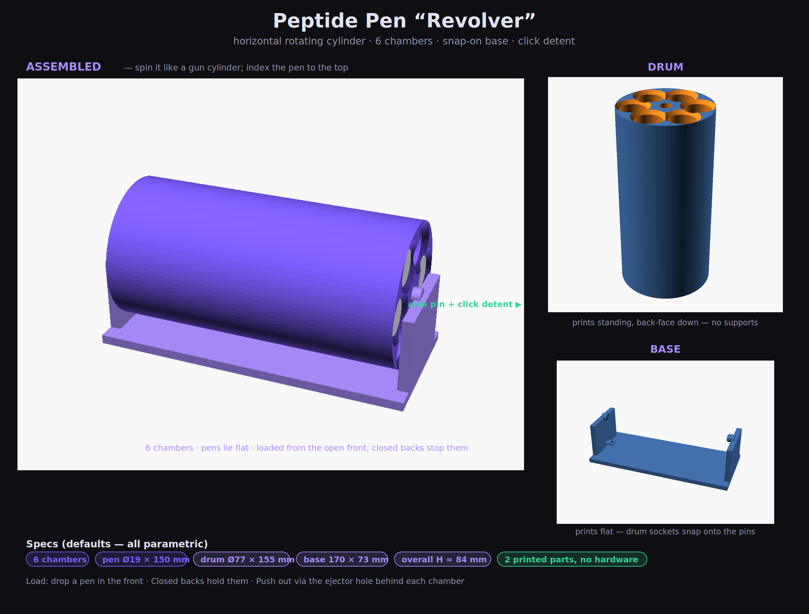

# Peptide Pen "Revolver"

A horizontal **rotating cylinder** that holds injector pens like the chambers of
a revolver. Spin the drum to bring the pen you want up to the top. Two 3D-printed
parts, no hardware.

## How it works
- **6 chambers** (parametric) in a ring, all parallel to a horizontal axis.
- The **drum spins** on two end uprights — give it a flick like a gun cylinder.
- **Load** a pen by dropping it into the open **front** of a chamber; the
  **closed back** stops it sliding through.
- **Unload** by pushing it back out through the small **ejector hole** behind
  each chamber (like an ejector rod), or just tip it out the front.
- Optional **click detent**: a printed leaf-spring on the base drops into a
  scalloped ring so the drum clicks to a stop at each chamber.

## The two parts
| Part | Prints | Notes |
|---|---|---|
| **Drum** | standing on its back face | Chambers come out as clean vertical bores — **no supports**. |
| **Base** | flat on the plate | Plate + two uprights with inward **axle pins**. The axle pins are short horizontal cylinders; they print fine, but add a touch of support under them if your printer struggles with overhangs. |

**Assembly:** tilt the drum so one end socket slips onto its axle pin, then
flex the far upright out a hair and the second pin snaps into the other socket.
It's then captive but spins freely. To take it apart, flex one upright back out.

## Default dimensions
| | |
|---|---|
| Pen assumed | Ø19 × 150 mm (set `pen_diameter`, `pen_length`) |
| Chambers | 6 (set `num_chambers`) |
| Drum | Ø77 × 155 mm |
| Base | 170 × 73 mm |
| Overall height | ≈ 84 mm |

Everything recalculates from the pen size + chamber count — the ring radius,
drum diameter, and base all resize automatically so the chambers never collide.

## Files
- `peptide-pen-revolver.scad` — the parametric model (edit this).
- `render_revolver.sh` — regenerates the renders + preview (needs OpenSCAD).
- `compose_revolver.py` — builds the labeled preview sheet.
- `revolver-preview.png`, `view_*.png` — the images above.

## Print & assemble
1. Open `peptide-pen-revolver.scad` in [OpenSCAD](https://openscad.org). Measure
   a real pen and set `pen_diameter` / `pen_length` (Window → Customizer for sliders).
2. Export each part: set `part = "drum"`, render (F6), Export STL. Repeat for
   `part = "base"`.
3. Slice:
   - **Drum:** as-oriented (standing), 0.2 mm layers, **15–20% infill**,
     3 perimeters. No supports.
   - **Base:** flat, same settings; optional light support under the axle pins.
   - **Material:** PETG or PLA. PETG is a bit more durable for the snap.
4. Snap the drum onto the base (see Assembly above) and spin.

## Tuning cheatsheet
| Want… | Change |
|---|---|
| More / fewer chambers | `num_chambers` |
| Looser / tighter pen fit | `clearance` |
| Freer / stiffer spin | `axle_gap` (bigger = freer) |
| Softer / firmer click | `detent_spring_th` (lower = softer), `detent_depth` |
| No click at all | `enable_detent = false` |
| Snappier vs easier base assembly | `axle_gap`, `pin_engage` |
| No push-out holes | `ejector_d = 0` |

> Tip: print the **base first** and test the snap/spin with the drum before
> committing to the full drum print — or set `num_chambers` low for a quick
> proof print, then bump it back up.

### Note on the detent
The click detent is a printed leaf-spring, so its feel depends on your material
and printer. It's enabled by default but fully optional — if the first print
feels too stiff or too soft, change `detent_spring_th` by a few tenths of a mm,
or set `enable_detent = false` for a smooth free spin.
