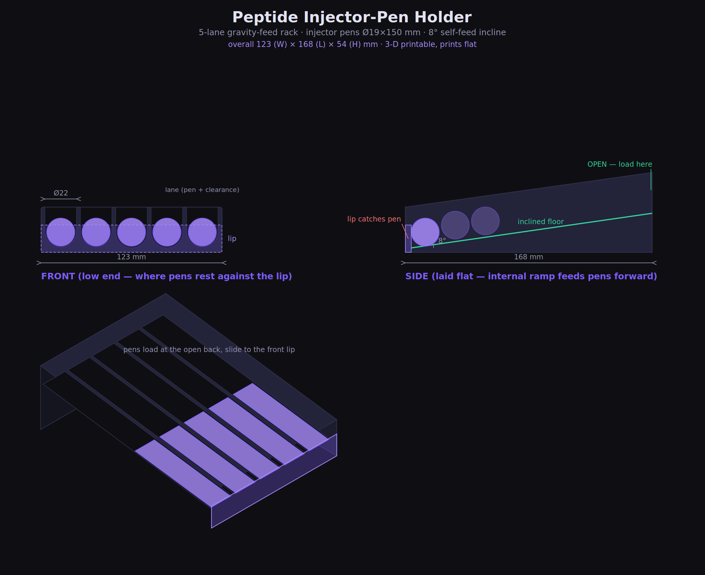

# Peptide Injector-Pen Holder

A 3D-printable, gravity-feed rack that holds injector pens lying flat. Designed
from Jason's hand sketch (the `1. SIDE` / `FRONT` drawing).

> **Looking for the rotating version?** See
> [`README-revolver.md`](README-revolver.md) for the horizontal "revolver"
> carousel — a spinning 6-chamber cylinder on a snap-on base.

## How your sketch was interpreted

| Your note (sketch) | In this design |
|---|---|
| `FRONT` — 4 vertical channels | Individual **lanes**, one pen each, divided by walls (default 5; set 4–6) |
| `Lip to catch pens` | A continuous **catch-lip** across the front that the pens rest against |
| `Insert side` | The **back end is open** — you load pens in from the high side |
| `Slides down / won't fall out` | Each lane floor is **tilted (incline)** so pens slide forward to the lip |
| Laid flat (writing facing you) | Prints and sits **flat**; the ramp is internal, so the part doesn't rock |

### One honest design note (the rolling-vs-sliding thing)
Your sketch shows separate lanes **and** pens "rolling down." For long injector
pens those two ideas fight each other: a pen lying lengthwise in a lane can only
**slide** forward — *rolling* would move it sideways into the next lane. So this
is built as inclined lanes with a front catch-lip, which keeps the pens neatly
separated and self-feeding. The **incline angle is a parameter** (`incline_deg`,
default 8°) so you can tune how eagerly they slide:

- **6–8°** — gentle, looks flat, pens settle forward with a small nudge.
- **10–15°** — reliably self-feeds smooth plastic/metal pens by gravity alone.
- **0°** — a plain flat organizer shelf, if you'd rather just place them.

If you actually want pens to **roll** and pool into a single front tray
(soda-can-dispenser style), that's a different layout — say the word and I'll
build that variant instead.

## Default dimensions

| | mm |
|---|---|
| Pen assumed | Ø19 × 150 (set `pen_diameter`, `pen_length` to your real pens) |
| Lanes | 5 (set `num_lanes`, 4–6 recommended) |
| Overall footprint | **123 (W) × 168 (L) × 54 (H)** |
| Incline | 8° |

Change the pen size and lane count at the top of the `.scad` file and every
other dimension recalculates automatically.

## Files
- `peptide-pen-holder.scad` — the parametric model (edit this).
- `render_preview.py` — regenerates `preview.png` (keep its numbers in sync if you tweak the model).
- `preview.png` / `preview.svg` — the dimensioned drawing above.

## Making it (3D print)

1. **Get OpenSCAD** (free): https://openscad.org
2. Open `peptide-pen-holder.scad`. Edit the parameters at the top — at minimum,
   measure one of your pens and set `pen_diameter` and `pen_length`.
   (Use **Window → Customizer** for sliders.)
3. **Render** (F6), then **Export → STL**.
4. Slice & print:
   - **Orientation:** as-is, flat on the bed (no supports needed).
   - **Material:** PETG or PLA.
   - **Layer height:** 0.2 mm.
   - **Infill:** 12–15% is plenty — there's a solid wedge under the ramp, and
     low infill keeps it light and fast.
   - **Walls:** 3 perimeters for a sturdy lip.

> Print **one lane first** as a test (set `num_lanes = 1`) to dial in the pen
> fit before committing to the full ~5–6 hour print of all lanes.

## Quick tuning cheatsheet

| Want… | Change |
|---|---|
| Pens to slide more easily | raise `incline_deg` |
| Looser / tighter pen fit | raise / lower `clearance` |
| More or fewer pens | `num_lanes` |
| Taller lip (harder to fall out) | raise the `0.45` factor in `lip_top` |
| Less plastic / faster print | lower `divider_rise`, keep infill low |
